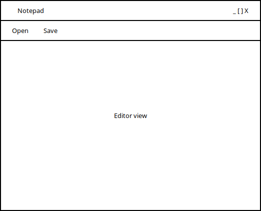

# Notepad - java-koolitus-2018-02

# Functional requirements
* Edit text in a large text area
* Open a text file and show it in the editor
* Save a editor contents to a text file
* Open and save buttons are on the top part of the window

# Design mockup
